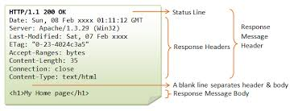

# Learning outcomes

By the end of this section, you should be able to:

1. Make use of the `request` library to query an API
2. Interact with a response object to interrogate the status codes and response
3. Extract the query result (`body`) from the API response,
4. Perform basic dictionary operations

{:.callout}

> ## Previously
>
> Previously, you had used string formatting to generate the URL for the API. For the purposes of standardization in this section, we will create a new variable with the URL as follows:
>
> ```python
> URL = "https://api-open.data.gov.sg/v2/real-time/api/twenty-four-hr-forecast?date=2025-01-01"
> ```

Now that you've become masters of crafting URLs using string formatting, it's time to actually send those URLs off into the digital world and bring back meaningful data.

You'll dive into using the powerful `requests` library to communicate with APIs, explore how to check if your requests were successful by examining status codes, and unlock the gold mine of data contained in the API response (if the query was successful!). Along the way, you'll get comfortable manipulating the returned data using Python's handy dictionary operations.

By the end, you'll be confidently turning your URLs into actionable insights — ready to tap into a whole universe of APIs!

# Interfacing with APIs in Python

While you can query an API by providing the APIs URL in the search bar, this is not scalable since someone needs to paste the URL, send the request, and copy the response somewhere for processing. Instead, we can do this directly in Python using `requests`.

{:.callout}

> ## Python interfaces for HTTP operations
>
> There are two popular libraries you can use for interfacing with APIs: `requests` and `urllib3`. We will be using `requests` because it is easier. On the other hand, `urllib3` is a lower-level library that exposes a lot more functionalities, making it more powerful option. In fact, `requests` actually builds on `urllib3` but remove many of the options by setting sensible default behaviours. If you are interested in building and customizing your requests, it will be worth looking at `urllib3` later.

As you can already guess, the first thing we will need to do is to load the `requests` library.

{:.challenge}

> ## Simple revision
>
> How do you load the `requests` library?

# Sending your first query and receiving your first response

Now that you have imported the `requests` library, lets get to performing your first query! In a new cell, do the following:

```python
# Assuming you have stored the URL as the variable URL
response = requests.get(URL)
response
```

This one simple line of code (wonderous, right!) will send a `GET` request to the API, and thereafter, fetch the response from the API. (As a matter of interest, `GET` is the same HTTP method used when you search using the URL address bar). In the code above, all we did was simply use the `get` function that is made available to us through the `requests` library. What is the class of the `response` object?

{:.callout}

> ## Pro Tip ⚡
>
> If you are not sure what functions are available in a package, you can simply pass the package (after importing) into the `dir` function. This will give you a list of all the functions provided by the package.

## Peering behind the response object

When the API returned its response, there are two parts to its response: the **header** and the **body**, as shown below.



Imaging the response as a package. The **header** tells you what is inside the package (i.e. the metadata). The **body** is the actual contents of the package. In Python, we can inspect both the header and the body by accessing them directly. We do this using the `.` method. The `.` method allows us to work with objects, including examining the attributes or calling class methods (functions defined for its class).

{:.callout}

> ## Pro Tip ⚡
>
> If you are not sure what methods are available for an object, you can simply pass the object into the `dir` function. This will give you a list of all the methods and attributes available in the object.

{:.challenge}

> ## Try it!
>
> Use the following line of code to inspect the response:
>
> ```python
> dir(response)
> ```
>
> What do you see?

Recall that all successful API calls should return `200` in its status code? We can check if our API call was successful using the following:

```python
response.status_code
```

How can you get the headers and body of the response object?

{:.challenge}

> ## Try it
>
> Try to peer under the hood of the response object using the `.` methods.
>
> ```python
> # TODO: Fill in the blanks
> headers = request._______
> body = request.______
> ```
>
> We have seen what a successful API query will return. Now, take the next 5 minutes to explore what happens if the API query fails. To do so, we will deliberately look up a resource we know to not exist yet in the API by providing a future date. Use the URL below to explore.
>
> ```python
> FAKE_URL = "https://api-open.data.gov.sg/v2/real-time/api/twenty-four-hr-forecast?date=2025-12-01"
> ```
>
> What do you observe?

# Dictionaries: Powerful data type for fast look ups

Now that we have an understanding of what a response object looks like, lets dive into getting the results from our API query. You will notice that there are two methods to get the results from the response object, as follows:

```python
string_method = response.text
json_method = response.json()
```

{:.callout}

> ## The missing parenthesis
>
> You will notice in the above code snippet that we had called `text` and `json` differently, with us adding a `()` behind `json`. Why is this the case?
> Earlier, we had talked about how in Python, all data are objects which contains both **data** and **methods**. It is this distinction that determines if a `()` is required. An analogy is to think of `()` as an action. If you need to call perform an action, you will follow with `()`. In the above snippet, calling `.json` is a method to convert the string into a `dictionary`. On the other hand, `text` only contains the data without doing anything.

Lets examine again what we get when we get the text from the response object:

```python
print (string_method)
```

While this is informative, it is close to impossible to extract information from it. For example, what is the `timestamp` of the response (i.e date when the measurement was taken)? While we can visually find it, it is non-trivial for Python to isolate that piece of information.

Because it is such a common task, Python provides the `json()` method (so long as the API request returned a JSON object) that automatically converts the string into a more searchable format, a dictionary, as shown below:

```python
type(json_method)

# Output: dict
```

A Python dictionary is like a real dictionary or a contact list in your phone.

- In a real dictionary, you look up a word (the key) to find its definition (the value).
- In your phone, you look up a name (the key) to get the phone number (the value).

In Python, we do the same thing: we store information as pairs of keys and values. One of the main advantages of dictionaries is its performance at retrieving information. In computer science speak, accessing (retrieving) the values associated with a key occurs in constant time. This means that the time complexity to access the value for a given key remains the same regardless of the size of the data set. This is something that is crucial when thinking about working with large datasets.

# Creating your first dictionary

Now that we know what a dictionary is, we will create a new one:

```python
my_first_dictionary = {"name": "jeremy", "institution": "sgh", "number_of_pets": 1}
```

Notice a few features in our new dictionary:

1. We use a `:` to separate the key (left-hand size) and value (right-hand size). This is the **key-value** pair talked about
2. We can mix data types in our dictionary. For instance, my name and institution are both strings, while the number of pets I have is a number

Once a dictionary is created, we can update it by adding new key-value combinations, or replace existing values for a key as follows:

```python
my_first_dictionary['name'] = 'jeremy ng'             # Update the value held in name
my_first_dictionary['nationality'] = 'singaporean'    # Add a new key-value to the dictionary
```

{: .challenge}

> ## Try it
>
> Try to update the dictionary in the snippet below:
>
> ```python
> # TODO: Fill in the blanks
> my_first_dictionary['name'] = 'jeremy ng'._____    # Capitalize the name
>
> # TODO: Create a new dictionary with pet information. The name of my pet is george, and he is a 5 year old poochon.
> pet_information = {____:_____, _____:_____, ____:____}
>
> # TODO: Add my pet information to the dictionary
> _____['pet_information'] = ________
>
> ```
>
> Here's a pic of George the Pooch, just to brighten everyone's afternoon.
> 

# Accessing information from the dictionary

# Conclusion

Congrats on finishing this exercise! 🎉 This is one small step into the world of working with APIs, but a big huge step for you in your programming journey. With your new skills in sending requests, checking responses, and handling data, you’re ready to unlock tons of powerful tools and information online 🚀. But how can we begin to manipulate the data fetched back from the API?
