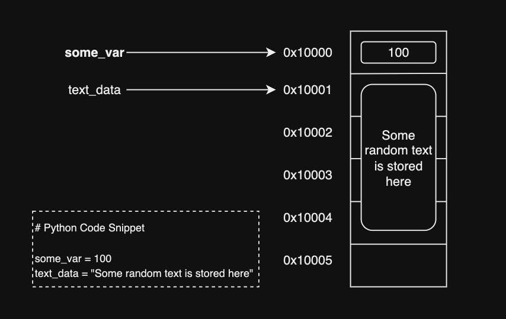

# Learning outcomes

By the end of this section, we should be:

1. Familar with lists,
2. Able to slice, subset and edit lists.
3. Appreciative of how lazy we can get with Python

# Most data are collections of values

So far, we’ve been looking at data that comes as a dictionary — like a phone book where each label (or key) points to one piece of information.

But what if a label points to more than one thing? For example, imagine asking an API for a list of all the tasks a user has. Instead of giving you just one task, it sends back a list of tasks. In Python, we call this a list — it’s like a shopping list, a to‑do list, or a playlist: an ordered collection of items. You can look at the first item, the second, the third, and so on.

Returning to your example API call before, lets take a look at the records that are contained in this response

```python
URL = "https://api-open.data.gov.sg/v2/real-time/api/twenty-four-hr-forecast?date=2025-01-01"

response = requests.get(URL)
forecast = response.json()

# To get the data, contained in the data key
data = forecast['data']
print (data.keys())

# Records, which are found in the records key.
records = data['records']
print (records)
```

There are in fact 6 different measurements that were taken. We can confirm this by finding the length of a list. This is done as follows:

```python
len(records)
```

A list in Python is defined as anything that has a length of zero or more. Let's dive a bit more into lists in Python, including how to create them and later, how do we work with them.

# Working with lists

Just like how an empty notebook is still a notebook, we can always create an empty list by doing the following:

```python
empty_list = []
```

{:.challenge}

> ## Methods in lists
>
> Try to get the list of methods and attributes that are available for working with lists first.

To find the length of a list, we can do (unsurprisingly) `len`. For instance,

```python
len(records)
```

tells us there are 6 records in the list.

# Surprise, surprise!

Here's an interesting exercise. Let's create a list `list1`, and we create a second list that is the same as `list1` as `list2`, as follows:

```python
list1 = ["A", "B", "C"]
list2 = list1
```

Now, we decided that we will now add a new value to `list1`.

{:.challenge}

> ## Try it
>
> Update `list1` by adding "D" to the last entry. How will you do this?
> 🔍 We will append "D" to the list.

Now, you will expect `list1` to be `["A", "B", "C", "D"]` while `list2` is `["A", "B", "C"]`, right? Try this:

```python
print (list1)
print (list2)
```

What do you see 🔍 ? Somehow, although you only changed `list1`, the change also affected `list2` . But why? To understand this, we will need to go back again to variables. But this time, we will peel under the hood to understand what is happening.

# Variables are really pointers to memory locations

The figure below shows what happens under the hood when we create a new variable.



When a variable is created, Python stores the value in the memory. However, the variable itself is a pointer to the memory location, not to the value. That is, the variable actually says "this is where this piece of data is found at", rather than "this is what this piece of data is". When we created `list2` by saying `list2 = list1`, what we actually told Python is "`list2` shares the same address as `list1`".

{:.challenge}

> ## Further prove of variables and memory
>
> To convince yourself, try the following:
>
> ```python
> list1 = [1,2,3]
> list2 = list1
> list3 = [1,2,3]
> print (list1 is list2)
> print (list1 is list3)
> ```
>
> What do you see?

Lets say you want to create `list2` with the exact same values as `list1`, but not want them to share the same memory address (as will be the case if we used `=`). You will need to do a **deep copy**, which is in contrast to a **shallow copy** that is done using `=`. In shallow copy, only the pointer is copied. On the other hand, a deep copy copies the values to a new address. This can be done as follows:

```python
list1 = [1,2,3]
list2 = list1.copy()
```

{:.challenge}

> ## Try this
>
> Verify that `list2` created using the method described above does not share the same memory as `list1`. Do this by (1) updating `list1` and then printing the values of both lists, and (2) using the `is` operator.

# 🔎 How to Obtain Specific Values in a List

A list is like a row of numbered mailboxes. Each mailbox has a number, and you can open the one you want to see what’s inside. In Python (as with other languages), these numbers are called **indexes**.

👉 Important: Python starts counting at 0, not 1.

That means the first item is at position 0, the second at 1, and so on. We can access specific values based on their positions in the list using the `[]` operator as shown below:

```python
shopping_cart = ['apple', 'cheese', 'flank steak', 'chicken thighs', 'vegetables', 'bread']

shopping_cart[0]     # apple
shopping_cart[1]     # cheese
```

{:.callout}

> ## A note on indexing
>
> You will often hear programming languages discribed as zero or one-indexed, and open or closed ranges. It is **very** important to know which system is used by your programming language. Python uses a zero-indexed, open-ranged coordinate system. Here's what this means:
>
> {:.challenge}
>
> > ## 🔹 Zero‑Indexed vs. One‑Indexed
> >
> > This means the first position is to be zero. This is common among programming languages. In a one-indexed coordinate system, we will need to use `shopping_cart[1]` to get the first value in the list.
>
> {:.challenge}
>
> > ## 🔹 Open vs. Closed Ranges
> >
> > Range is a sequence of numbers used for tracking. The difference between open and closed ranges is that in an open-ended system, the last number is not included in the counting. For example: `shopping_card[0:3]` will return the first 3 items and not the 4 (index position 3 corresponds to the fourth entry in the list).
>
> It can be really confusing what to indicate as the ranges. I personally use this formula: `[start: start + number of entries ]`. This is one of the consequence of the open-ended range: when you subtract the end index from the start index, you will get back exactly the number of elements requested.

Lets say we want to get the first three elements of the list. We can do this as follows:

```python
shopping_cart = ['apple', 'cheese', 'flank steak', 'chicken thighs', 'vegetables', 'bread']

shopping_cart[0:3]     # ['apple','cheese','flank steak']

# The above can be simplified as follows:
shopping_cart[:3]
```

By default, if you do not supply the start value, Python assumes you want to get everything starting from the first value. Similarly, if you did not define the ending index, Python assumes you want to slice to the last value.

{: .challenge}

> ## Try this
>
> Try to do the following slicing exercises
>
> ```python
> # Our sample list
> animals = ["cat", "dog", "rabbit", "parrot", "hamster"]
> print ("The full list:", animals)
> # Try these:
> print ("First animal:", animals[_])      # should print "cat"
> print ("Third animal:", animals[_])      # should print "rabbit"
> print ("All animals from rabbit to the end:", animals[])
> ```

You can also specify negative index values. For example, if we want to obtain the last 3 values:

```python
animals[-3:]
```

Finally, we can specify **step sizes** as follows:

```python
animals[::2] # ['cat', 'rabbit', 'hamster']
```

{:.challenge}

> ## Reversing a list
>
> Combining these characteristics together, how can we reverse a list?

# Sorting a collection

Now that you know how to subset a list, how about sorting it? In Python, there are two methods which can be used to perform sorting, as shown below:

```python
unsorted_list = [3,2,5,1,8,7,3,5]

unsorted_list2 = unsorted_list[:]

# In-place sorting
unsorted_list.sort()

sorted(unsorted_list)
```

The difference between in-place sorting (done by doing `.sort()`) will edit the data in-memory. This does away with the need for us to assign a new variable to the sorted list. On the other hand, using the `sorted` function will create a new copy of the data in memory; hence, we will need to perform a variable assignment.

{:.challenge}

> ## Try it
>
> What happens when you try to assign `unsorted_list.sort()` to a variable? What is the value contained in the variable?

# Laziness is the order of the day

So far, we have talked about how to assign values to a single variable. Lets say we have a list containing `x`,`y`,`z` coordinates as follows:

```python
coordinates = [1.0, -0.5, 2, 'test_coordinates']
x = coordinates[0]
y = coordinates[1]
z = coordinates[2]
```

The above will work; however, it is clunky and repetitive. At the same time, a good programmer is also a lazy programmer and the less we type, the better! Thankfully, in keeping with the ethos of laziness, Python provides a much faster way for us to do this! This is called **unpacking**. The example below highlights how it is done.

```python
coordinates = [1.0, -0.5, 2]
x,y,z = coordinates
```

✅ In one stroke, we avoided three separate lines of code.
That’s cleaner, easier to read, and we saved about 30 keystrokes 😁.

{:.callout}

> ## Unpacking a list using `*`
>
> This is a new functionality only available in the newer versions of Python 3. Imagine the following situation:
>
> ```python
> coordinates = [1.0, -0.5, 2, 'japan', 'tokyo', 'december']
> ```
>
> Lets say we want to extract the coordinates into 3 variables (x,y and z), the country into a list, and the month as a new variable. Here's one way to do it:
>
> ```python
> x,y,z = coordinates[0:3]
> country = coordinates[3:5]
> month = coordinates[5]
> ```
>
> While this is already more concise than trying to assign each individually, it is still a bit long. We can simplify this even more, as follows:
>
> ```python
> x,y,z,*country,month = coordinates
> ```
>
> Here, `*` simply tells Python to capture everything else that was not assigned to its own variable. Note that you can only do `*` unpacking in a single line. This is because under the hood, Python is basically saying "I will assign the first three to x,y,z, and the last to month. Everything else will be assigned to country." You can imagine why you cannot have more than one `*` capture - Python simply does not know how to assign what are the "leftovers"

{:.challenge}

> ## ValueError
>
> A common error you might run into is the `ValueError`, which happens when we try to do the following:
>
> ```python
> x,y = coordinates
> ```
>
> This is because the list `coordinates` has more than two values, and Python does not know how to assign the remaining values. To fix this, we can use `*` unpacking as described above. If we only need the first two values and nothing else, we can do it as follows:
>
> ```python
> x,y,*_ = coordinates
> ```
>
> `_` is often used in Python to indicate something that will not be referred to in any other parts of the script.

# Hands-on exercises

In the next few minutes, try the following exercises. We will be on hand to help if you are stuck.

```python
# TODO: Fill in the blanks

animals = ["cat", "dog", "rabbit", "parrot", "hamster"]

# Sort the list of animals alphabetically out-of-memory
sorted_animals = _______(animals)
print (sorted_animals)
# Output: ['cat', 'dog', 'hamster', 'parrot', 'rabbit']

# Assign parrot to a new variable
bird = animals[_]

# Assign the first two animals as a new variable
common_pets = animals[____]
# Output: ['cat', 'dog']

# Assign the first two animals to a single variable (common_pets), and all
# others into individual variables
__, rabbit, parrot, hamster = animals
print (common_pets)

#Output: ['cat', 'dog']
```

# Conclusion

We started with the idea that most data aren’t just single values, but collections. In this section, you learned that:

1. Lists let us store and organize ordered collections of items.
2. We can slice and index lists to get exactly what we want, whether from the start, the end, or with custom steps.
3. Python’s zero‑based, open‑range system might feel odd at first, but it’s incredibly consistent once you get used to it.
4. And finally, with unpacking, we saw how Python rewards “lazy programmers” by letting us write less code that’s cleaner and easier to read.

At this point, you should be comfortable creating, editing, slicing, sorting, and unpacking lists — all powerful tools for working with real‑world data.

➡️ Up next, we’ll see how we can work with numeric data types - and in particular, the all important dates and times.
