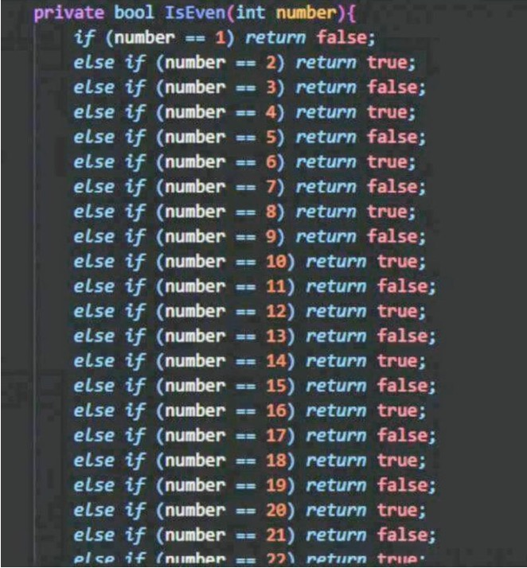

# Introduction

Imagine you need to print whether a value is even or odd, and do this for all values between one and a million.
One way might be to write a code line this:



Clearly, this will not be the way to go! Here's where a loop 🔄 comes in handy.

Loops let us automate repetition — instead of writing the same code again and again, we teach Python to do it for us. Whether you want to process a list of emails, count from 1 to 100, or keep checking for new data until a condition is met, loops are the tool you’ll reach for.

Think of loops like giving instructions to a helpful robot:

1. You tell it what task to repeat.
2. You tell it how many times to repeat or until when to keep going.
3. The robot then follows your instructions, step-by-step, again and again — until it hits the end of the loop.

Lets dive into the types of loops, and how do they function!

# Loops come in two flavors

In Python, as is the case with most other programming languages, there are two main flavors:

- `For` loops — when you know how many times to repeat (like going through each item in a list).
- `While` loops — when you want to repeat until a condition is met (like waiting until a sensor reads a safe temperature).

Loops help us write less code but do way more. We will delve deeper into how we instruct Python in each loop.

# `for` loops: when the number of repetition is known before hand

A for loop is like saying: “For each item in this collection, do something.”
You use it when you know exactly how many things you want to go through — like a list of names, numbers, or any collection of items.

How it works:

1. You tell Python what you want to loop over (a list, range, or other iterable).
2. Python picks each item one by one, and runs your code with that item.

Here is an example:

```python
fruits = ["apple", "banana", "cherry"]

for fruit in fruits:
    print(f"I love {fruit}!")
# Output:
# I love apple!
# I love banana!
# I love cherry!
```

Under the hood, this is what happened:

1. `for` - instructs Python that we will be iterating down every element in the list
2. `fruit` - variable used to an element during a pass
3. `in` - instructs Python which variable/iterable we will be using in the for loop
4. The indented code block tells Python what to do in each iteration. (here - `print(f"I love {fruit}!")` says to print the name of the fruit)

{:.callout}

> ## Iterables
>
> For loops don’t just work on lists — they can loop over any iterable data structure! This includes:
>
> - Tuples: (1, 2, 3)
> - Strings: "hello" (loops over each character)
> - Dictionaries: loops over keys by default

We can also write **nested** loops - that is, we have a loop within a loop. A common use case of this is when you are trying to take the **cartesian product** of multiple iterables (all possible combinations of 2 or more iterables). Here is an example:

```python
coordinates = []
x_coordinates = [1,2,3,4,5]
y_coordinates = [1,2,3,4,5]

for x in x_coordinates:
  for y in y_coordinates:
    coordinates.append(x,y)
print (coordinates)
```

{:.challenge}

> ## Try it!
>
> Try to use a for loop to generate the cartesian product of 3 lists - x,y and z. Use the following scaffold.
>
> ```python
> coordinates = []
> x_coordinates = [1,2,3,4,5]
> y_coordinates = [6,7,8,9]
> z_coordinates = [1,2]
> # TODO: Find all the possible combinations of coordinates for x, y and z.
> ```

## Try it - Estimating π with Monte Carlo Simulation 🎲

Monte Carlo methods are a clever way to solve problems using randomness and repeated trials. To estimate π, imagine a square with a circle perfectly inscribed inside it (the circle touches the square’s edges).

- The square’s side length is 2, so its area is 4.
- The circle’s radius is 1, so its area is $\pi \times 1^2 = \pi $.
- If we randomly "throw darts" at this square, some will land inside the circle, others outside. The ratio of darts inside the circle to total darts thrown roughly equals the ratio of their areas:

$$
  \frac{\text{Points inside circle}}{\text{Total points}} \approx \frac{\pi}{4}
$$

Rearranged, we get:

$$
 \pi \approx 4 \times \frac{\text{Points inside circle}}{\text{Total points}}
$$

By simulating many random points and counting how many fall inside the circle, we can estimate π!

Below is the pseudocode which we will be implementing:

{:.callout}

> ## Pseudo-code
>
> Initialize total_points to 0
> Initialize points_inside_circle to 0
> For i from 1 to N (number of random points to generate):
>
> - Generate a random x coordinate between -1 and 1
> - Generate a random y coordinate between -1 and 1
> - Calculate distance_from_center = sqrt(x^2 + y^2)
> - If distance_from_center <= 1: - Increment points_inside_circle by 1
> - Increment total_points by 1
>   Estimate pi as: 4 \* (points_inside_circle / total_points)
>   Print the estimated value of pi

To help you, here's an outline of the Python code:

```python
import random

N_ITERATIONS = 1e5 # 100,000 points
IN_CIRCLE = 0
TOTAL_POINTS = 0

# TODO: Write the loop statement
_________________________:
  x = random.uniform(0, 1)
  y = random.uniform(0, 1)
  sum_of_squares = x**2 + y**2
  # TODO: Write the conditional test to increment IN_CIRCLE.
  ______________________:
    IN_CIRCLE += 1
  TOTAL_POINTS += 1 # Increment our total points

estimate = 4 * IN_CIRCLE/TOTAL_POINTS
print (estimate)
```

# `while`: A loop for all of ages

We’ve seen how for loops help us repeat actions a known number of times. But what if you want to keep doing something until a certain condition changes — and you don’t know beforehand how many times that will take?
Enter the while loop! The while loop repeats a block of code as long as a condition is true.
Prior to each iteration, it checks the truthfulness of the condition before each iteration. Once the condition becomes `false`, the loop stops.

Think of it like this:

> "While the light is green, keep walking."
> The moment the light turns red (condition is false), you stop.

The code below shows an example of how the `while` loop is set up in Python

```python
count = 0

while count < 5:
  print("Counting:", count)
  count = count + 1 # Update the variable so the loop eventually ends

print("Done!")
```

What happens here?

- The loop checks: Is count less than 5?
  - If yes, it prints and increases count by 1.
- Once count hits 5, the condition count < 5 is false, so the loop ends.
- Then it prints "Done!"

{:.callout}

> ## Important!
>
> Make sure something inside the loop changes the condition — otherwise, you’ll have an infinite loop! That means your > program gets stuck repeating forever. We’ll see examples soon on how to avoid that.

That’s the gist of while loops — handy when you don’t know exactly how many repeats you need upfront but want to keep going while something is true.

{:.challenge}

> ## Try it! Writing a countdown timer
>
> Write a countdown timer in Python using the while loop.
>
> ```python
> start = 10
> # TODO: Check whether start is larger than 0
> ___________:
>     print (start)
>     # TODO: Update the variable start
>     _______
> ```

# Conclusion

Awesome job exploring while loops! You’ve learned how to repeat actions as long as a condition holds true — giving your programs the flexibility to keep going until they’re told to stop.
Just remember: always make sure your loop’s condition will eventually become false, or else you’ll end up stuck in an infinite loop (and nobody wants that!).

We only have one last thing to do: Learn how to read and write files in Python. Once we have done this, we are ready to write our own Python program to process the results you got back from our API.
