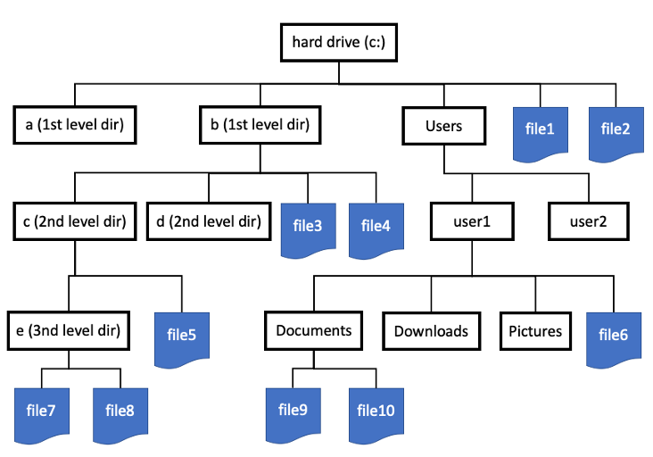

# 📂 Working with Files in Python

We’ve learned how to write functions, handle errors, and use loops to repeat actions. But so far, every time we’ve run our programs, the data we created disappears the moment the program ends. That’s like writing a brilliant essay on a whiteboard and then erasing it when you leave the room.

👉 To make our work stick, we need a way to store information permanently. That’s where files come in.

Think of your computer’s file system as a giant library:

- Folders are like bookshelves that organize things.
- Files are like the books — they contain the actual information (text, images, music, data, etc.).
- Paths (like C:/Users/Alice/Documents/report.txt or /home/alice/report.txt) are like the directions that tell you exactly where in the library to find the book.

When Python works with files, it’s like opening a book:

- Open it (grab the book from the shelf),
- Read or write (look at or add content),
- Close it (put it back properly so nothing gets lost).

By the end of this section, you’ll know how to:

1. Open files for reading and writing,
2. Store your program’s results for later use,
3. Load information from files so your programs can work with real-world data.

# 🗂️ How File Systems Work: Hierarchies

A file system has a tree like structure, with roots and leaves. For instance, study the following file system



There are two ways which we can specify a path: **absolute** and **relative** paths. We will talk a little more in detail about each method to specify paths. Absolute paths providing an exact address. These paths always starts from the root (C:\ or /). On the other hand, relative paths are like providing instructions on how to get from where you are now to another location. Relative paths are shorter and more convenient — but they depend on where you’re standing in the tree. We use the `.` to indicate **current directory**, `../` indicates one directory before.

# 🖥️ Working with Files and Directories in Python (`os` module)

Before we read and write files, it’s important to know where we are in the file system. The `os` module in Python allows us to do this.

```python
import os

# To look at what is in the current directory
os.listdir()

# To get the current directory you are in (location in the tree)
os.getcwd()

```

{:.challenge}

> ## Try it
>
> Try using the `os` module to explore your present working directory.

# 📂 File types: Delimiters matter

When working with files, not all text files are the same. The structure of the file matters just as much as its content. One of the most common ways data is stored is in delimited text files.

{:.callout}

> ## ✅ What’s a delimiter?
>
> A delimiter is a special character that separates pieces of data in a file. Think of it like the spaces between words > in a sentence — without them, everything would run together.
>
> | File Type                        | Delimiter Used | Example Line          |
> | -------------------------------- | -------------- | --------------------- |
> | **CSV** (Comma-Separated Values) | `,` (comma)    | `Alice,25,New York`   |
> | **TSV** (Tab-Separated Values)   | `\t` (tab)     | `Alice\t25\tNew York` |
> | **PSV** (Pipe-Separated Values)  | `\|`           | Alice\|25\|New York   |
>
> 🧐 Why does it matter?
> If you try to read a TSV file using a CSV reader that expects commas, Python will think the whole line is just one big string! That’s why knowing your delimiter is crucial.

# 📖 Reading and Writing Files in Python

Once we know what kind of file we’re working with (CSV, TSV, or something else), the next step is learning how to read its contents into our program.

In Python, the most common way to read files is with the built-in open() function. When we open a file, we need to tell Python:

1. Which file to open (the file name or path).
2. How to open it (called the mode).

Some common modes are:

- `r` → read mode (default)
- `w` → write mode (overwrites the file)
- `a` → append mode (adds new data without overwriting)

Before we start reading a file, we should first create a file. Copy the following codes!

{:.challenge}

> ## The Zen Of Python
>
> The Zen Of Python is a set of "rules" that defines what is considered "Pythonic". We can access this document using the following code:
>
> ```python
> import this
> ```
>
> At this point you will see a wall of text containing pointers - 19 to be exact - stipulating what the guiding philosophies are in Python code design. We will first capture this long text using the following code:
>
> ```python
> zen_of_python = []
> for char in this.s:
>     zen_of_python.append(this.d.get(char, char))
> zen_of_python = "".join(zen_of_python)
> # A more elegant way is to do this:
> # zen_of_python = "".join([this.d.get(c, c) for c in this.s])
> ```
>
> Who can explain what did we just do in this code block?

To create a file, we will do the following:

```python
with open('sample-file.txt', 'w') in outfile:
  outfile.write("This is a line of text in a sample file\n")
```

This is what happens under the hood:

- `open('sample-file.txt', 'w')` - Tells Python to open a file called `sample-file.txt`.
- The `w` means write mode → create the file if it doesn’t exist, or overwrite it if it does.
- `with ... as outfile`: The with keyword makes sure the file is properly closed after we’re done writing, even if something goes wrong.
- outfile is just the name we’re giving to the open file object (you could call it anything).
- `outfile.write("This is a line...")`: Writes text into the file. The `\n` at the end adds a newline, so if we write more text later, it will go on the next line.
  When you run this code, a new file named `sample-file.txt` will appear in your working directory, containing the text you wrote. 🎉

Every single line in an output file is written out explicitly in a `write`. For instance, the following will write two lines of text in `sample-text.txt`:

```python
with open('sample-file.txt', 'w') in outfile:
  outfile.write("This is a line of text in a sample file\n")
  outfile.write("This is another line of text in the sample file\n")
```

{:.challenge}

> ## Try this!
>
> How can you add a third line to the file `sample-text.txt` so that it will contain the following lines?
>
> ```bash
> This is a line of text in a sample file
> This is another line of text in the sample file
> This is the last line in the sample file
> ```

# Conclusion

Great work! 🎉 You’ve just learned how to create and write to files in Python. By opening a file in write mode (`w`), you can store text directly onto your computer — which means your programs can now save information for later use. We have also talked about how you can use the same function - `open` but using the `r` mode to read a file back in.

We will now take a short break. After the break, you will have the opportunity to put into practice what you have learned over the last two days!
